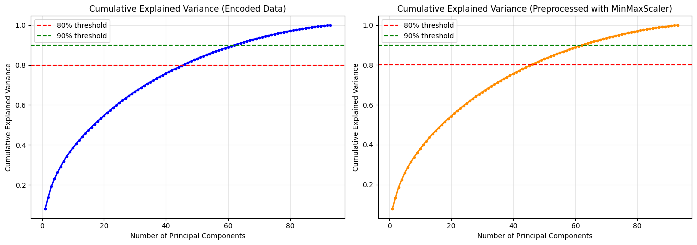
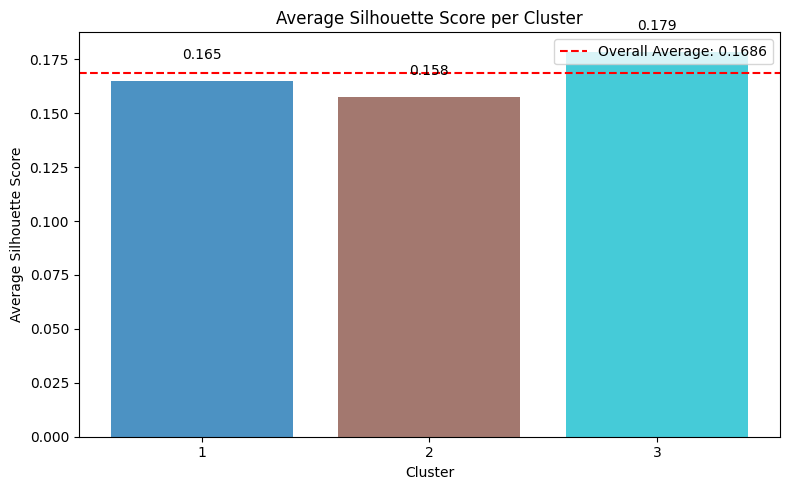

# PCA Analysis on Young People Survey Dataset

Principal Component Analysis and K-Means clustering on survey data to identify meaningful customer profiles.

**Course:** Computational Linear Algebra for Large Scale Problems  
**University:** Politecnico di Torino  
**Academic Year:** 2025/2026

---

## Overview

This project applies PCA for dimensionality reduction and K-Means clustering to analyze the Young People Survey (YPS) dataset. The goal is to simulate a business scenario where a company wants to identify meaningful customer profiles from survey responses.

## Dataset

- **Source:** Young People Survey (University of Bratislava, 2013)
- **Samples:** 506 respondents
- **Features:** 93 selected features across 7 categories:
  - Finance (spending habits)
  - Health (smoking, alcohol, lifestyle)
  - Interests (hobbies, academic subjects)
  - Movies (genre preferences)
  - Music (genre preferences)
  - Personality (traits, views, opinions)
  - Phobias (fears)

## Methodology

### 1. Preprocessing
- **Encoding:** OrdinalEncoder for categorical features (Smoking, Alcohol, Internet usage) - chosen because categories have natural ordering
- **Scaling:** MinMaxScaler to normalize all features to [0, 1]

### 2. PCA Analysis
- Computed all 93 principal components
- Selected m = 5 PCs (capturing 25.84% of variance)
- Named PCs based on feature loadings:

| PC | Name | Key Features |
|----|------|--------------|
| PC1 | Tech & Action | Cars, Gadgets, Adrenaline sports, Action movies |
| PC2 | Music & Culture | Classical music, Opera, Rock n roll, Religion |
| PC3 | Social Extroversion | Shopping, Friends, Active sport, Appearance |
| PC4 | Emotional Struggles | Criminal damage, Ageing fears, Loneliness |
| PC5 | Lifestyle Habits | Alcohol, Smoking, Cars |

### 3. K-Means Clustering
- Tested k ∈ {3, ..., 10} using silhouette score
- **Best k = 3** (silhouette score = 0.169)

## Results

### Cumulative Explained Variance


Both encoded and preprocessed data require ~46 PCs for 80% variance, showing that survey responses capture diverse, independent aspects of personality.

### Cluster Visualization


Three distinct customer profiles identified in the PCA space.

### Cluster Quality


| Cluster | Silhouette Score | Size |
|---------|------------------|------|
| Cluster 1 | 0.165 | 148 |
| Cluster 2 | 0.158 | 147 |
| Cluster 3 | 0.179 | 211 |

### Customer Profiles

| Cluster | Name | Description |
|---------|------|-------------|
| 1 | Tech Enthusiasts | High tech interest, gadgets, action movies. ~85% male. |
| 2 | Culture Lovers | Classical music, opera appreciation, cultural interests. Balanced gender. |
| 3 | Laid-back Mainstream | Average preferences, no strong interests. ~88% female. |

## Key Findings

- **Gender** is the strongest predictor of cluster membership
- PC1 (Tech & Action) strongly correlates with gender differences
- Age and Education show no significant cluster separation
- Low silhouette scores indicate overlapping clusters, which is realistic for continuous personality traits

## Repository Structure

```
├── pca.ipynb   # Main notebook
├── responses_hw.csv                      # Dataset
├── columns_hw.csv                        # Column descriptions
├── figures/                               # Plots
│   ├── Cumulative_Explained_Variance.png
│   ├── ScoreGraph_with_3Cluster.png
│   └── avg_Silhouette_per_cluster.png
└── README.md
```

## Requirements

```
numpy
pandas
scikit-learn
matplotlib
seaborn
```

## Authors

- [Erfan Moghadasian](https://github.com/erythm)

## License

This project is for educational purposes as part of the Computational Linear Algebra course at Politecnico di Torino.
