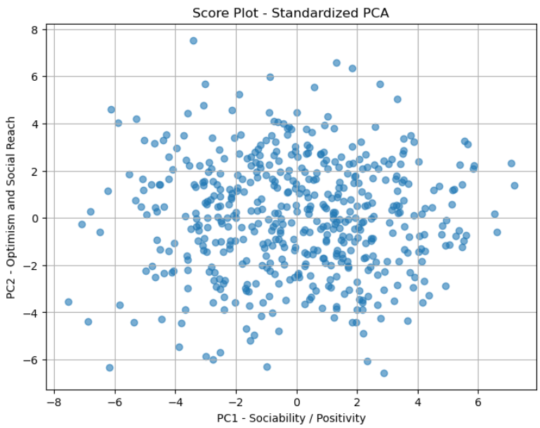
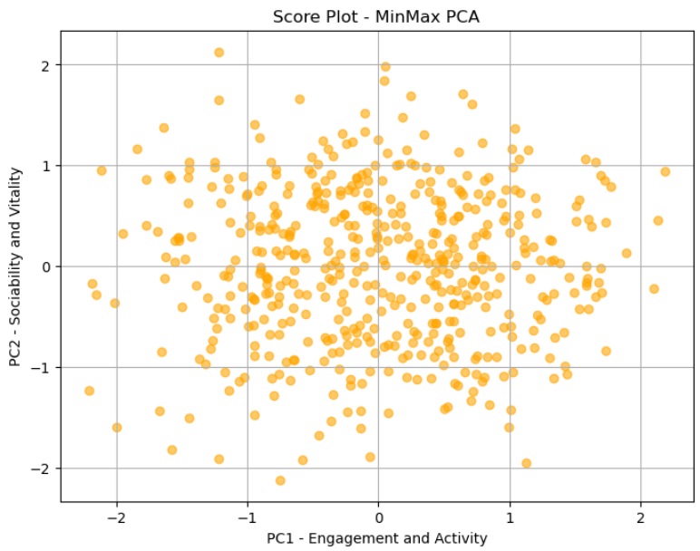
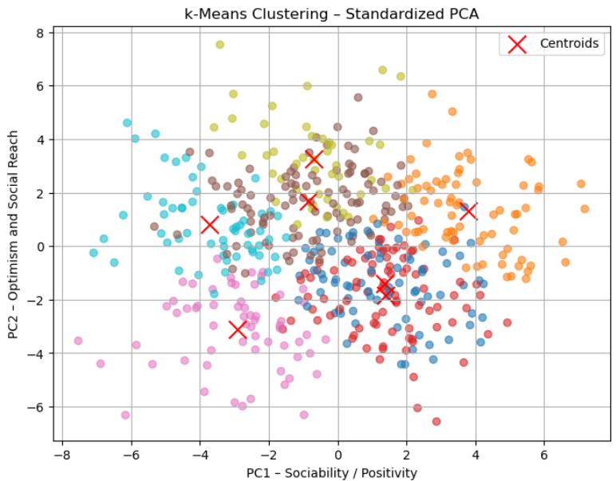
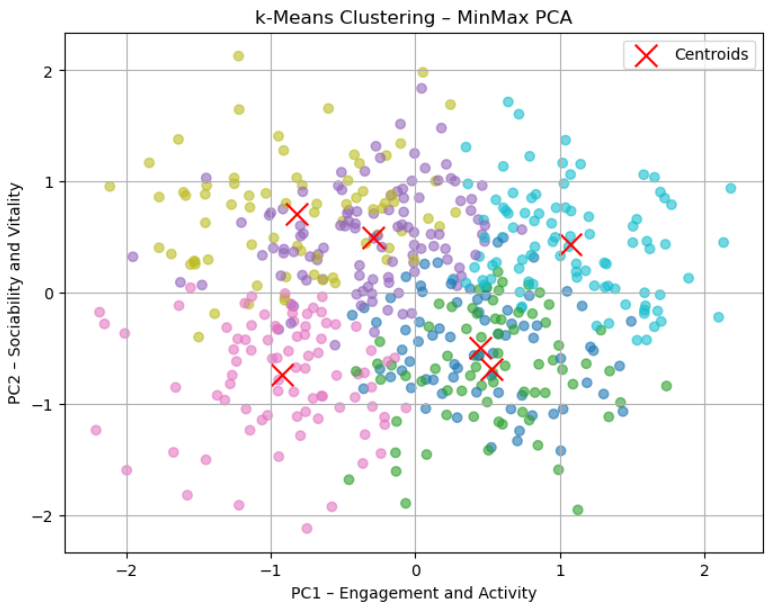

# PCA and Clustering on Demographic Data

This repository contains the implementation and report for a project involving Principal Component Analysis (PCA), dimensionality reduction, and clustering techniques applied to survey-based demographic data. The project was completed as part of the course "Computational Linear Algebra for Large Scale Problems".

## 📂 Contents

- `pca.ipynb` – Main Jupyter notebook
- `responses_hw.csv` – Raw dataset with anonymized responses.
- `columns_hw.csv` – Feature metadata.
- `figures/` – Visualizations

---

## 📊 Visual Results

### 🧪 PCA Score Plots

| Standardized PCA                              | MinMax PCA                                 |
|-----------------------------------------------|---------------------------------------------|
|  |  |

### 🧬 k-Means Clustering Results

| k-Means on Standardized PCA                   | k-Means on MinMax PCA                      |
|-----------------------------------------------|---------------------------------------------|
|  |  |

---

## 🔧 Key Features

- 🧮 PCA on survey features (after selection and cleaning)
- 🔁 Comparison between StandardScaler and MinMaxScaler
- 🎯 k-Means clustering on 2D PCA embeddings
- 📉 Evaluation using visual clustering quality and centroid spread
- 🧠 Interpretation of Principal Components

---

## 📊 Project Goals

- Analyze and reduce the dimensionality of complex survey data using PCA
- Interpret principal components and visualize variance
- Apply k-Means clustering to PCA-transformed data
- Evaluate clustering performance using both internal and external metrics

## 📄 License

This project is for academic use only. No personal or identifiable data is included.
